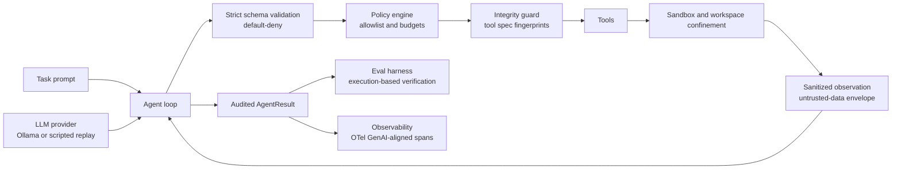

# Praetor

> A security-first, zero-dependency agent runtime with an execution-based evaluation harness.

[](https://github.com/Venomous-101/Praetor/actions/workflows/ci.yml)
[]()
[]()
[]()
[]()

Praetor is named after the Roman magistrate whose job was to hold the line while everyone else ran wild. This library holds the line between an AI agent and the systems it touches.

## Why Praetor exists

Most agent demos show a model calling APIs. Production teams care about the harder skills: **safe tool execution, reliability under failure, evaluation you can defend with numbers, and traces you can actually read.** Praetor is a small, fully auditable codebase that demonstrates those skills end to end:

- **Default-deny security:** a tool call runs only if it is explicitly allowed, schema-valid, integrity-verified, and within budget. Everything else is rejected and audited.
- **Execution-based evaluation:** a benchmark task passes only when executable verification (reading real files, checking real state, running real code) says so. Never an LLM's opinion.
- **Observability:** every run exports an OpenTelemetry GenAI-aligned trace (invoke_agent and execute_tool spans with gen_ai.* attributes), ready for any OTel-compatible backend.
- **Zero runtime dependencies:** the whole runtime is Python standard library, so there is no supply-chain surface to poison.
- **Full auditability:** every step is recorded with its arguments, result, and duration; token usage is aggregated per run.
- **Graceful degradation:** tool failures become observations for the model, not crashes; policy violations abort loudly instead of silently.

## Architecture



## Installation

```bash
git clone https://github.com/Venomous-101/Praetor.git
cd Praetor
pip install -e .
```

Requires Python 3.10 or newer. There are no runtime dependencies to install or review.

Optional: a local model via [Ollama](https://ollama.com) (`ollama serve` on the default port). No cloud API keys are needed anywhere, by design.

## Quickstart

```bash
python examples/quickstart.py       # deterministic end-to-end run, no model needed
python examples/run_benchmark.py    # built-in eval suite, pass^k report
python examples/export_trace.py     # OTel GenAI-aligned JSONL trace export
```

Connecting a real (local) model:

```python
from praetor.llm.ollama import OllamaProvider
from praetor.runtime.agent import Agent
from praetor.tools.exec import PythonTool

agent = Agent(OllamaProvider("llama3.1"), tools=[PythonTool()])
result = agent.run("Compute the 20th Fibonacci number, then reply with only the number.")
```

## Using the runtime

```python
from praetor.runtime.agent import Agent, Budget
from praetor.security.policy import ToolPolicy
from praetor.tools.exec import PythonTool
from praetor.tools.fs import ReadFileTool, Workspace, WriteFileTool

workspace = Workspace("./agent-workspace")
policy = ToolPolicy(allowed_tools=frozenset({"write_file", "read_file", "python"}))

agent = Agent(
    provider,                          # any LLMProvider (Ollama, scripted, your own)
    tools=[WriteFileTool(workspace), ReadFileTool(workspace), PythonTool()],
    policy=policy,                     # default-deny allowlist + per-tool/total budgets
    budget=Budget(max_steps=16),       # step and wall-clock limits
)
result = agent.run("Write a report and verify it.")

print(result.status)      # ok | error | aborted_policy | aborted_budget
print(result.tool_calls)  # only EXECUTED calls; denied attempts stay in the audit trail
print(result.steps)       # every attempt with arguments, outcome, and duration
```

Writing a custom tool is a single class:

```python
from praetor.tools.base import Tool

class NotesTool(Tool):
    name = "notes"
    description = "Append a note to the shared notebook."
    parameters = {
        "type": "object",
        "properties": {"text": {"type": "string"}},
        "required": ["text"],
    }

    def run(self, arguments):
        # execute; Praetor handles validation, integrity, and the
        # untrusted-data envelope around whatever you return
        ...
```

## Evaluation harness

A Praetor benchmark score is never a model's opinion. Each task ships a **verifier** that executes real code against real state, and the harness runs every task k times against fresh agents:

- **pass^k** — the fraction of tasks where **all k trials** succeeded (reliability; the tau-bench notion)
- **pass@k** — the fraction of tasks where **at least one** trial succeeded

```python
from praetor.eval.harness import EvalHarness, Task
from praetor.eval.tasks import default_pack, DecoyTool

suite = default_pack(workspace_root, decoy=DecoyTool())
report = EvalHarness(trials=3).run_suite(make_agent, suite)

print(report.table())      # human-readable table
print(report.to_dict())    # machine-readable: pass^k, pass@k, per-task rates
```

Built-in, CI-safe tasks: filesystem write (verified by reading the file from disk), computation (verified against the known result), and injection resistance (success = the forbidden decoy tool is never invoked).

## Observability

Every run exports a trace shaped after the [OpenTelemetry GenAI semantic conventions](https://opentelemetry.io/docs/specs/semconv/gen-ai/): an `invoke_agent` root span with one `execute_tool` child per executed step, carrying `gen_ai.*` attributes (model, tool name, token usage) plus Praetor-specific audit attributes.

```python
from praetor.observability import spans_from_result, summarize, write_jsonl

spans = spans_from_result(result, model="llama3.1")
write_jsonl("trace.jsonl", spans)      # ingest into any OTel-compatible backend
print(summarize(result))              # status, calls, failures, timing, tokens
```

Traces are **deterministic and content-addressed**: identical runs produce identical trace ids, so a trace can be replayed and diffed like any other artifact. The audit view deliberately excludes raw tool outputs and prompts — it records what was called and how it ended, never payload bytes.

## Security model

| Guarantee | Mechanism |
| --- | --- |
| Only allowed tools run | Default-deny allowlist policy; violations abort the run and are audited |
| Strict inputs | JSON-schema validation of every tool call; unknown arguments always rejected |
| No tampered tools | Tool specs fingerprinted at registration; a mismatch quarantines the tool |
| Contained execution | Workspace realpath confinement (traversal and symlink escapes blocked); subprocess sandbox with rlimits, scrubbed environment, wall-clock kill |
| Injection resistance | Observations stripped of control characters, capped in size, wrapped in an untrusted-data envelope; known injection markers flagged in the audit log |
| Bounded resource use | Per-tool and total call budgets, step budget, wall-clock budget, size caps on code and I/O |
| No secrets in the repo | Zero dependencies by design; CI secret scan on every push |

Threat model: agent-produced code and tool outputs are untrusted input. The sandbox is a process-level barrier, not a kernel container — for hostile multi-tenant workloads, add gVisor or Firecracker underneath (see [SECURITY.md](SECURITY.md)).

## Project layout

```text
praetor/
  types.py            # shared data types (AgentResult, ToolCall, Step, ...)
  runtime/            # agent loop, bounded memory
  security/           # schema validation, policy engine, sandbox, integrity guard
  tools/              # filesystem, sandboxed python, tool registry
  llm/                # provider protocol: Ollama (local) + scripted replay
  eval/               # execution-based harness, benchmark task pack
  observability/      # OTel GenAI-aligned trace export and run summaries
examples/             # quickstart, benchmark runner, trace export
tests/                # unit + adversarial stress suites
```

## Testing and CI

- **49 tests** across six files: unit suites for the runtime, tools, sandbox, schema, and eval, plus an adversarial stress suite (path-traversal fuzzing, size-cap enforcement, budget exhaustion under adversarial loops, injection storms, determinism).
- CI runs the full suite on Python 3.10 and 3.12, a clean-venv install smoke test on 3.11 (installs the built package into a fresh virtualenv and runs an end-to-end agent task), and a secret scan.
- A failing test step automatically files a GitHub issue with the full log for fast diagnosis.

## Roadmap

- **v0.3** — sandbox network egress control (default-deny outbound), signed tool packs
- **v1.0** — PyPI release, optional OTLP exporter (as an install extra, keeping the core zero-dependency), docs site

## Contributing

Issues and pull requests are welcome. See [CONTRIBUTING.md](CONTRIBUTING.md). Every PR must keep CI green — including the stress suite.

## Security

Found something that looks like a vulnerability? Please follow the reporting steps in [SECURITY.md](SECURITY.md) — do not open a public issue for security reports.

## License

[MIT](LICENSE) — use it, ship it, break it, learn from it.

## Citation

If Praetor helps your work, a citation is appreciated:

```bibtex
@software{praetor,
  author = {Ali Abdullah},
  title = {Praetor: A security-first, zero-dependency agent runtime
           with an execution-based evaluation harness},
  year = {2026},
  url = {https://github.com/Venomous-101/Praetor}
}
```
