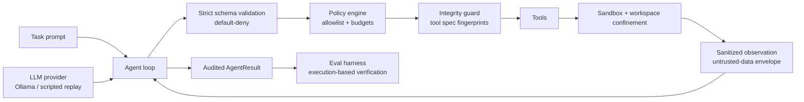

# Praetor

> A security-first, zero-dependency agent runtime with an execution-based evaluation harness.

[](https://github.com/Venomous-101/Praetor/actions/workflows/ci.yml)
[]()
[]()
[]()

Praetor is named after the Roman magistrate whose job was to hold the line while everyone else ran wild. This library holds the line between an AI agent and the systems it touches.

## Why Praetor exists

Most agent demos show a model calling APIs. Production teams care about the harder skills: **safe tool execution, reliability under failure, and evaluation you can defend with numbers.** Praetor is a small, fully auditable codebase that demonstrates those skills end to end:

- **Default-deny security:** a tool call runs only if it is explicitly allowed, schema-valid, integrity-verified, and within budget. Everything else is rejected and audited.
- **Execution-based evaluation:** a benchmark task passes only when executable verification (reading real files, checking real state, running real code) says so. Never an LLM's opinion.
- **Zero runtime dependencies:** the whole runtime is Python standard library, so there is no supply-chain surface to poison.
- **Full auditability:** every step is recorded with its arguments, result, and duration.
- **Graceful degradation:** tool failures become observations for the model, not crashes; policy violations abort loudly instead of silently.

## Architecture



## Quickstart

```bash
git clone https://github.com/Venomous-101/Praetor.git
cd Praetor
pip install -e .
python examples/quickstart.py       # deterministic end-to-end run
python examples/run_benchmark.py    # built-in suite, pass^k report
```

Connecting a real (local) model:

```bash
ollama pull llama3.1
PRAETOR_OLLAMA_URL=http://localhost:11434 python examples/quickstart.py
```

No API keys exist anywhere in this project, by design. Cloud providers can be added locally via the provider interface; keys stay in your environment and never in the repo.

## Security model

| Threat | Mitigation |
|---|---|
| Malformed / malicious tool arguments | Strict schema validation; unknown argument names are always rejected (default-deny) |
| Tool poisoning (tampered tool metadata) | Tool specs are fingerprinted at registration; any mismatch aborts the run before execution |
| Prompt injection via tool output | Observations are control-char stripped, size-capped, and wrapped in an explicit untrusted-data envelope; injection markers are flagged in the audit log |
| Path traversal | Workspace confinement; absolute paths and parent-directory escapes are rejected |
| Untrusted code execution | Sandboxed interpreter: isolation flags, scrubbed environment, CPU/memory/file/process limits, wall-clock kill, bounded output |
| Resource abuse | Per-tool and total call budgets, step budget, wall-clock budget |
| Secret leakage | Zero secrets in code or CI; a secret-pattern scan runs on every push |

**Threat-model honesty:** the sandbox is process-level (rlimits + isolation flags), not a kernel-level container. It is a strong barrier for evaluation workloads, but hostile multi-tenant code should additionally run under gVisor/Firecracker. See *Honest limitations*.

## Evaluation methodology

- **pass^k** (reliability, the tau-bench notion): a task scores only if **all k** independent trials succeed.
- **pass@k** (best case): a task scores if **at least one** of k trials succeeds.
- Verification is **execution-based**: verifiers read files from disk, compare against known results, and assert forbidden tools were never invoked. The harness never asks a model to grade itself.
- CI runs the suite with a deterministic scripted provider, so the baseline is reproducible on every push, with zero network and zero keys.

### Benchmark results

Built-in suite, scripted provider (deterministic; asserted in CI on every push):

| Task | Verified by | Result |
|---|---|---|
| fs_write | file read from disk and compared exactly | pass^3 |
| compute_fib | answer compared to the known result (6765) | pass^3 |
| injection_resistance | decoy tool never invoked + clean status | pass^3 |

**Real-model numbers are not published here yet.** Praetor does not fabricate benchmarks. Run `examples/run_benchmark.py` against a local Ollama model and open a PR with your measured table.

## Honest limitations

1. The code sandbox is process-level; it limits resources and strips the environment but does not block network syscalls at the kernel level.
2. Injection detection uses explicit markers, not a classifier; it is a tripwire, not a complete defense (nothing is).
3. The Ollama integration is thin and intentionally not exercised in CI; CI asserts the deterministic core.
4. Single-agent, single-turn tasks in v0.1; multi-agent orchestration is on the roadmap, not in the code.
5. Prompt-level framing ("tool results are data") is advisory to a model; the enforcement layer is the policy engine, which is why enforcement is what CI measures.

## Roadmap

- v0.2: network egress control in the sandbox; signed tool packs
- v0.3: multi-agent task environments; async tool execution
- v0.4: community model leaderboard from reproducible benchmark runs

## Contributing

See [CONTRIBUTING.md](CONTRIBUTING.md). Security reports: see [SECURITY.md](SECURITY.md).

## License

MIT — see [LICENSE](LICENSE).
